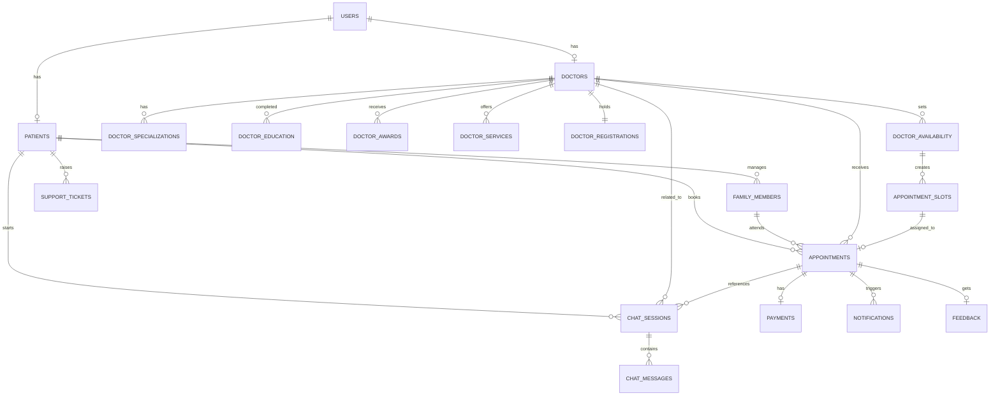

# Schedula System Flow and Database Design

This document explains the **Schedula** patient appointment system based on the provided wireframe. The design covers the patient journey from login to post-consultation follow-up, and maps that flow to the database tables required to support the application.[1]

## Product flow

The wireframe begins with mobile-number-based sign-up or sign-in, followed by doctor discovery through a search screen with navigation for doctor search, records, appointments, and profile.[1] After selecting a doctor, the patient views a profile with specialization, years of experience, achievement badge, services, and consulting availability before proceeding to book an appointment.[1]

The booking flow continues through date selection, consulting type selection, time selection, confirmation, patient detail entry, and optional payment to reduce waiting time.[1] After booking, the system supports appointment history, appointment detail view, reschedule, cancellation, feedback, reminder notifications, post-consultation re-engagement, IVR-linked booking, patient chat, support tickets, friends and family management, and Google review prompting.[1]

### End-to-end patient journey

1. User enters mobile number and signs in or signs up.[1]
2. Patient searches for a doctor and opens a doctor profile.[1]
3. Patient reviews doctor details, services, and availability.[1]
4. Patient chooses date, consulting type, and slot time.[1]
5. Appointment is confirmed with token number and consulting time.[1]
6. Patient adds complaint and personal details.[1]
7. Patient may pay before consultation.[1]
8. Patient tracks appointment status, live queue, or reschedules/cancels if needed.[1]
9. Patient gives feedback after consultation and receives reminders or follow-up prompts.[1]

## Database design

The ER design is based on the wireframe entities directly shown or clearly implied by the screens. These include users, patients, doctors, availability, appointment slots, appointments, payments, notifications, feedback, support, family members, and patient chat.[1]

To make the doctor profile feel complete like a real medical booking platform, the design also includes doctor profile enrichment through specializations, education, awards, services, and mandatory medical council registration. This still stays aligned with the wireframe because the doctor profile screen already shows specialization, experience, achievement, services, and consulting timings.[1]

### Core tables

| Table | Purpose |
|---|---|
| `users` | Stores authentication-level identity for patients, doctors, and admins.[1] |
| `patients` | Stores patient profile information linked to a user account.[1] |
| `family_members` | Supports booking for self, wife, son, and other dependents shown in the wireframe.[1] |
| `doctors` | Stores core doctor profile information like specialization, experience, qualification summary, and optional achievement.[1] |
| `doctor_specializations` | Stores one or more doctor specialties for richer doctor search and profile display.[1] |
| `doctor_education` | Stores medical education and qualification history.[1] |
| `doctor_awards` | Stores optional awards or recognitions such as Gold Medalist-style achievements.[1] |
| `doctor_registrations` | Stores mandatory medical council registration information for trust and verification.[1] |
| `doctor_services` | Stores services offered by a doctor, such as pregnancy, newborn, and new mother care.[1] |
| `doctor_availability` | Stores recurring weekly consulting availability.[1] |
| `appointment_slots` | Stores bookable date/time slots created from doctor availability.[1] |
| `appointments` | Stores actual bookings, token numbers, visit type, status, and complaint context.[1] |
| `payments` | Stores consultation payment records and transaction state.[1] |
| `notifications` | Stores appointment reminders, reschedule notices, cancellation messages, and review prompts.[1] |
| `feedback` | Stores doctor, clinic, and waiting time feedback shown in the feedback screen.[1] |
| `chat_sessions` | Stores patient chat sessions related to a complaint or appointment.[1] |
| `chat_messages` | Stores individual patient, bot, doctor, or system chat messages.[1] |
| `support_tickets` | Stores patient-raised support issues and their resolution status.[1] |

## Table relationships

The `users` table acts as the base identity table, with a one-to-one relationship to either `patients` or `doctors` depending on the role.[1] A patient can manage many family members, create many appointments, raise support tickets, and start multiple chat sessions.[1]

A doctor can have many services, specializations, education records, awards, availability records, appointment slots, appointments, and chat sessions, while the doctor registration record is mandatory and modeled as one registration record per doctor.[1] An appointment belongs to one patient and one doctor, may optionally reference a family member and slot, and can have associated payment, notifications, feedback, and chat context.[1]

## Mermaid ER diagram



## PostgreSQL schema

```sql
CREATE EXTENSION IF NOT EXISTS "pgcrypto";

CREATE TABLE users (
    id UUID PRIMARY KEY DEFAULT gen_random_uuid(),
    phone VARCHAR(15) UNIQUE NOT NULL,
    email VARCHAR(255) UNIQUE,
    password_hash TEXT,
    role VARCHAR(20) NOT NULL CHECK (role IN ('PATIENT', 'DOCTOR', 'ADMIN')),
    created_at TIMESTAMP DEFAULT CURRENT_TIMESTAMP,
    updated_at TIMESTAMP DEFAULT CURRENT_TIMESTAMP
);

CREATE TABLE patients (
    id UUID PRIMARY KEY DEFAULT gen_random_uuid(),
    user_id UUID UNIQUE NOT NULL REFERENCES users(id) ON DELETE CASCADE,
    full_name VARCHAR(150) NOT NULL,
    gender VARCHAR(20),
    dob DATE,
    blood_group VARCHAR(10),
    created_at TIMESTAMP DEFAULT CURRENT_TIMESTAMP
);

CREATE TABLE family_members (
    id UUID PRIMARY KEY DEFAULT gen_random_uuid(),
    patient_id UUID NOT NULL REFERENCES patients(id) ON DELETE CASCADE,
    full_name VARCHAR(150) NOT NULL,
    gender VARCHAR(20),
    age INT CHECK (age >= 0),
    relationship VARCHAR(50) NOT NULL,
    is_default_profile BOOLEAN DEFAULT FALSE
);

CREATE TABLE doctors (
    id UUID PRIMARY KEY DEFAULT gen_random_uuid(),
    user_id UUID UNIQUE NOT NULL REFERENCES users(id) ON DELETE CASCADE,
    full_name VARCHAR(150) NOT NULL,
    specialization VARCHAR(120),
    years_of_experience INT CHECK (years_of_experience >= 0),
    qualification_summary VARCHAR(255),
    achievement VARCHAR(255),
    bio TEXT,
    consultation_fee NUMERIC(10,2),
    verification_status VARCHAR(20) DEFAULT 'PENDING'
        CHECK (verification_status IN ('PENDING', 'VERIFIED', 'REJECTED')),
    is_active BOOLEAN DEFAULT TRUE,
    created_at TIMESTAMP DEFAULT CURRENT_TIMESTAMP
);

CREATE TABLE doctor_specializations (
    id UUID PRIMARY KEY DEFAULT gen_random_uuid(),
    doctor_id UUID NOT NULL REFERENCES doctors(id) ON DELETE CASCADE,
    specialization_name VARCHAR(120) NOT NULL,
    is_primary BOOLEAN DEFAULT FALSE
);

CREATE TABLE doctor_education (
    id UUID PRIMARY KEY DEFAULT gen_random_uuid(),
    doctor_id UUID NOT NULL REFERENCES doctors(id) ON DELETE CASCADE,
    degree_name VARCHAR(120) NOT NULL,
    institution_name VARCHAR(180) NOT NULL,
    completion_year VARCHAR(10),
    description TEXT
);

CREATE TABLE doctor_awards (
    id UUID PRIMARY KEY DEFAULT gen_random_uuid(),
    doctor_id UUID NOT NULL REFERENCES doctors(id) ON DELETE CASCADE,
    award_title VARCHAR(180) NOT NULL,
    award_year VARCHAR(10),
    description TEXT
);

CREATE TABLE doctor_services (
    id UUID PRIMARY KEY DEFAULT gen_random_uuid(),
    doctor_id UUID NOT NULL REFERENCES doctors(id) ON DELETE CASCADE,
    service_name VARCHAR(120) NOT NULL,
    description TEXT
);

CREATE TABLE doctor_registrations (
    id UUID PRIMARY KEY DEFAULT gen_random_uuid(),
    doctor_id UUID UNIQUE NOT NULL REFERENCES doctors(id) ON DELETE CASCADE,
    medical_council_number VARCHAR(100) NOT NULL UNIQUE,
    medical_council_name VARCHAR(150) NOT NULL,
    registration_year INT,
    state_council VARCHAR(100),
    is_verified BOOLEAN DEFAULT FALSE,
    verified_at TIMESTAMP
);

CREATE TABLE doctor_availability (
    id UUID PRIMARY KEY DEFAULT gen_random_uuid(),
    doctor_id UUID NOT NULL REFERENCES doctors(id) ON DELETE CASCADE,
    day_of_week VARCHAR(15) NOT NULL
        CHECK (day_of_week IN ('MONDAY', 'TUESDAY', 'WEDNESDAY', 'THURSDAY', 'FRIDAY', 'SATURDAY', 'SUNDAY')),
    start_time TIME NOT NULL,
    end_time TIME NOT NULL,
    consultation_mode VARCHAR(20) NOT NULL
        CHECK (consultation_mode IN ('REGULAR', 'ONLINE')),
    max_tokens INT,
    is_available BOOLEAN DEFAULT TRUE,
    CHECK (start_time < end_time)
);

CREATE TABLE appointment_slots (
    id UUID PRIMARY KEY DEFAULT gen_random_uuid(),
    doctor_availability_id UUID NOT NULL REFERENCES doctor_availability(id) ON DELETE CASCADE,
    doctor_id UUID NOT NULL REFERENCES doctors(id) ON DELETE CASCADE,
    slot_date DATE NOT NULL,
    start_time TIME NOT NULL,
    end_time TIME NOT NULL,
    slot_status VARCHAR(20) DEFAULT 'AVAILABLE'
        CHECK (slot_status IN ('AVAILABLE', 'BOOKED', 'BLOCKED')),
    CHECK (start_time < end_time)
);

CREATE TABLE appointments (
    id UUID PRIMARY KEY DEFAULT gen_random_uuid(),
    doctor_id UUID NOT NULL REFERENCES doctors(id) ON DELETE CASCADE,
    patient_id UUID NOT NULL REFERENCES patients(id) ON DELETE CASCADE,
    family_member_id UUID REFERENCES family_members(id) ON DELETE SET NULL,
    slot_id UUID UNIQUE REFERENCES appointment_slots(id) ON DELETE SET NULL,
    consultation_type VARCHAR(20) NOT NULL
        CHECK (consultation_type IN ('REGULAR', 'ONLINE')),
    visit_type VARCHAR(30)
        CHECK (visit_type IN ('FIRST_TIME', 'REPORT', 'FOLLOW_UP', 'FAMILY_APPOINTMENT')),
    booking_source VARCHAR(20)
        CHECK (booking_source IN ('APP', 'IVR')),
    token_number INT,
    chief_complaint TEXT,
    appointment_status VARCHAR(25) DEFAULT 'BOOKED'
        CHECK (appointment_status IN ('BOOKED', 'WAITING', 'CONSULTED', 'UNABLE_TO_MEET', 'RESCHEDULED', 'CANCELLED')),
    expected_consulting_time TIMESTAMP,
    booked_at TIMESTAMP DEFAULT CURRENT_TIMESTAMP
);

CREATE TABLE payments (
    id UUID PRIMARY KEY DEFAULT gen_random_uuid(),
    appointment_id UUID UNIQUE NOT NULL REFERENCES appointments(id) ON DELETE CASCADE,
    amount NUMERIC(10,2) NOT NULL CHECK (amount >= 0),
    payment_status VARCHAR(20) DEFAULT 'PENDING'
        CHECK (payment_status IN ('PENDING', 'PAID', 'FAILED', 'REFUNDED')),
    payment_method VARCHAR(50),
    transaction_ref VARCHAR(150) UNIQUE,
    paid_at TIMESTAMP
);

CREATE TABLE notifications (
    id UUID PRIMARY KEY DEFAULT gen_random_uuid(),
    appointment_id UUID REFERENCES appointments(id) ON DELETE CASCADE,
    user_id UUID NOT NULL REFERENCES users(id) ON DELETE CASCADE,
    type VARCHAR(30) NOT NULL
        CHECK (type IN ('REMINDER', 'RESCHEDULE', 'CANCELLATION', 'REENGAGEMENT', 'REVIEW_REQUEST', 'GENERAL')),
    title VARCHAR(200) NOT NULL,
    message TEXT NOT NULL,
    is_read BOOLEAN DEFAULT FALSE,
    created_at TIMESTAMP DEFAULT CURRENT_TIMESTAMP
);

CREATE TABLE feedback (
    id UUID PRIMARY KEY DEFAULT gen_random_uuid(),
    appointment_id UUID UNIQUE NOT NULL REFERENCES appointments(id) ON DELETE CASCADE,
    patient_id UUID NOT NULL REFERENCES patients(id) ON DELETE CASCADE,
    doctor_rating INT CHECK (doctor_rating BETWEEN 1 AND 5),
    clinic_rating INT CHECK (clinic_rating BETWEEN 1 AND 5),
    waiting_time_rating INT CHECK (waiting_time_rating BETWEEN 1 AND 5),
    comments TEXT,
    created_at TIMESTAMP DEFAULT CURRENT_TIMESTAMP
);

CREATE TABLE chat_sessions (
    id UUID PRIMARY KEY DEFAULT gen_random_uuid(),
    patient_id UUID NOT NULL REFERENCES patients(id) ON DELETE CASCADE,
    appointment_id UUID REFERENCES appointments(id) ON DELETE SET NULL,
    doctor_id UUID REFERENCES doctors(id) ON DELETE SET NULL,
    complaint_context TEXT,
    created_at TIMESTAMP DEFAULT CURRENT_TIMESTAMP
);

CREATE TABLE chat_messages (
    id UUID PRIMARY KEY DEFAULT gen_random_uuid(),
    chat_session_id UUID NOT NULL REFERENCES chat_sessions(id) ON DELETE CASCADE,
    sender_type VARCHAR(20) NOT NULL
        CHECK (sender_type IN ('PATIENT', 'BOT', 'DOCTOR', 'SYSTEM')),
    message_text TEXT NOT NULL,
    created_at TIMESTAMP DEFAULT CURRENT_TIMESTAMP
);

CREATE TABLE support_tickets (
    id UUID PRIMARY KEY DEFAULT gen_random_uuid(),
    patient_id UUID NOT NULL REFERENCES patients(id) ON DELETE CASCADE,
    appointment_id UUID REFERENCES appointments(id) ON DELETE SET NULL,
    issue_type VARCHAR(100) NOT NULL,
    description TEXT NOT NULL,
    status VARCHAR(20) DEFAULT 'OPEN'
        CHECK (status IN ('OPEN', 'IN_PROGRESS', 'RESOLVED', 'CLOSED')),
    created_at TIMESTAMP DEFAULT CURRENT_TIMESTAMP
);

CREATE INDEX idx_doctor_availability_doctor_id ON doctor_availability(doctor_id);
CREATE INDEX idx_appointment_slots_doctor_id ON appointment_slots(doctor_id);
CREATE INDEX idx_appointments_doctor_id ON appointments(doctor_id);
CREATE INDEX idx_appointments_patient_id ON appointments(patient_id);
CREATE INDEX idx_notifications_user_id ON notifications(user_id);
CREATE INDEX idx_chat_sessions_patient_id ON chat_sessions(patient_id);
CREATE INDEX idx_chat_messages_session_id ON chat_messages(chat_session_id);
```

## Notes on design decisions

The `doctors` table keeps `specialization`, `qualification_summary`, and optional `achievement` for fast profile rendering because the wireframe shows those details directly on the doctor card and profile view.[1] Separate doctor tables still exist for richer structured data so the design can support a more complete medical profile without losing a practical display-oriented structure.[1]

The registration table is mandatory because doctor verification through medical council data improves trust and aligns with real medical appointment platforms. Chat is included because the wireframe explicitly contains a patient chat screen with complaint-specific guidance, so representing that interaction in the schema improves completeness.[1]